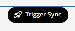
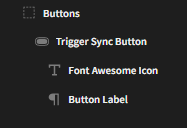
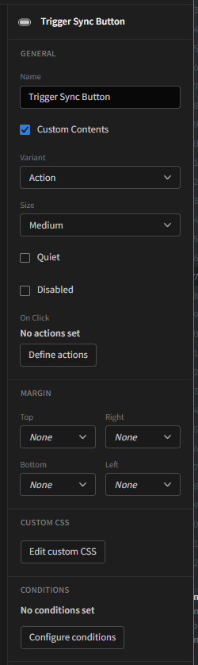
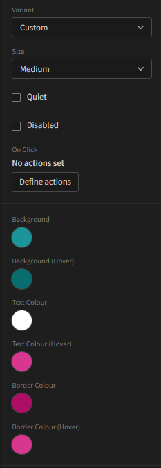

# Budibase Button+
An advanced button component that allows nesting of children components to enhance the design of the button

Button inherits default style from your app layout options like the default button, but allows additional customization.




# Description
Find out more about [Budibase](https://github.com/Budibase/budibase).

# How to use
1. Import the plugin into your budibase instance (see Budibase documentation for more info)

2. Add the Font Awesome component to your application

3. Use the built-in label, or enable custom contents to nest other components in the button


 



4. Set the variant type to `custom` for full control over the button style


## Instructions

To build your new  plugin run the following in your Budibase CLI:
```
budi plugins --build
```

You can also re-build everytime you make a change to your plugin with the command:
```
budi plugins --watch
```

